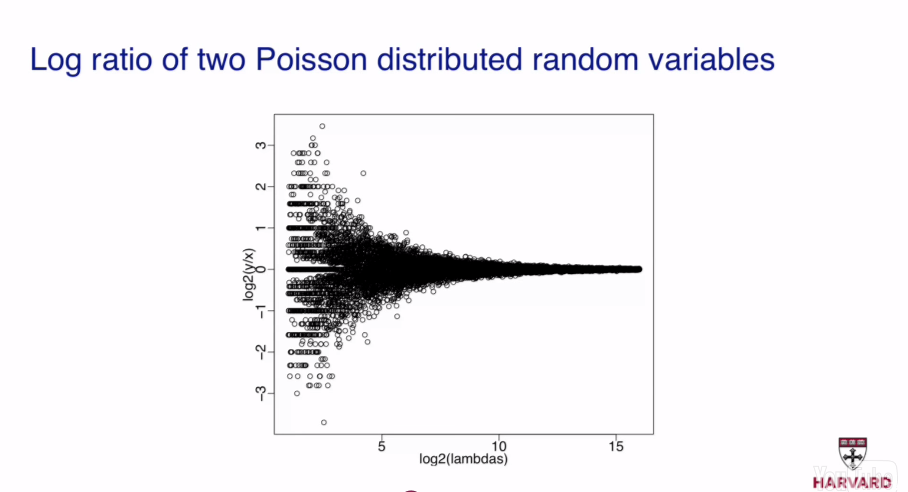
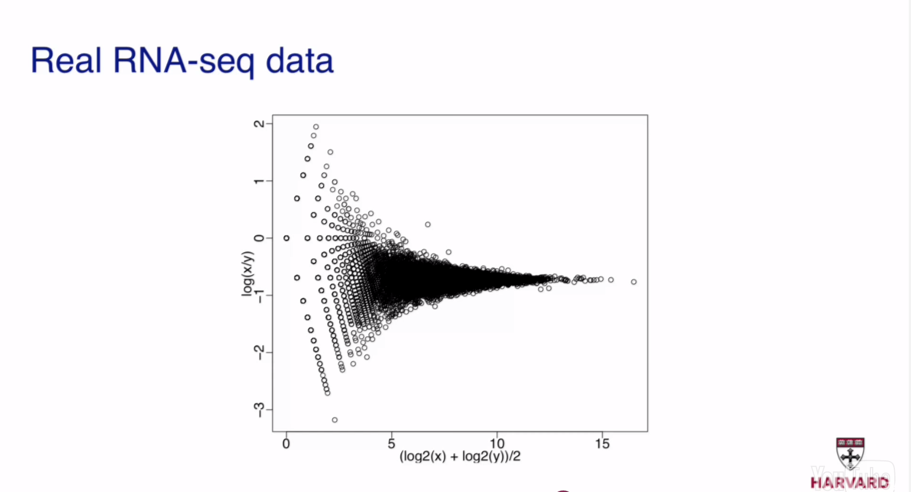

```{r echo=FALSE, message=FALSE}
library(rafalib)
library(dplyr)
library(magrittr)
library(printr)
library(latex2exp)
```

http://genomicsclass.github.io/book/pages/rnaseq_gene_level.html
http://www.bioconductor.org/help/workflows/rnaseqGene

## Introduction to RNA-seq

RNA-seq is a technology that uses next-generation/high-throughput sequencing (NGS/HTS) to reveal a snapshot of the kind and amount of RNA molecules in a biological sample at a given moment in time.

- Transcript quantification based on RNA-seq counts
    - [Mortazavi2008](http://www.ncbi.nlm.nih.gov/pubmed/18516045)
    - [Marioni2008](http://www.ncbi.nlm.nih.gov/pubmed/18550803)
    - [Jiang2009](http://www.ncbi.nlm.nih.gov/pubmed/19244387)
    - [Trapnell2010](http://www.ncbi.nlm.nih.gov/pubmed/20436464)
    - [Gierlinski2015](http://www.ncbi.nlm.nih.gov/pubmed/26206307)

- [The state of the art in RNA-seq analysis](http://www.ncbi.nlm.nih.gov/pubmed/24296473)
    - [Steijger2013](http://www.ncbi.nlm.nih.gov/pubmed/24185837)
    - [Engström2013](http://www.ncbi.nlm.nih.gov/pubmed/24185836)

Transcript quantification based on RNA-seq counts is unstable due to ambiguity and bias (not-uniform coverage along the length of the transcript due to technical bias).

- [Challenges in and recommendations for experimental design and analysis of RNA-seq data](http://www.ncbi.nlm.nih.gov/pubmed/25271838)

Here, we will focus on comparing the expression levels of genes across different samples, by counting the number of reads which overlap the exons of genes defined by a known annotation of the reference genome.

---

The FPKM (fragments per kilobase of sequence per million mapped reads) is a normalized measure of expression level (having divided out the transcript length and the number of mapped reads).

TPM (transcripts per million), is a linear scaling of the FPKM, such that we would expect a gene with 1 TPM to have one molecule in a population of one million mRNA.

TPM is equal to: (FPKM / sum(FPKM)) * 1 million

CPM (counts per million)


## RNA-seq data sources

- [European Nucleotide Archive (ENA)](http://www.ebi.ac.uk/ena) [EMBL-EBI]
- [Sequence Read Archive (SRA)](http://www.ncbi.nlm.nih.gov/sra) [NCBI]
- [ReCount](http://bowtie-bio.sourceforge.net/recount)


## Quality control and pre-processing of RNA-seq reads using FastQC and other tools

- [FastQC](http://www.bioinformatics.babraham.ac.uk/projects/fastqc)
    - [Manual](http://www.bioinformatics.babraham.ac.uk/projects/fastqc/Help)
    - [Chapter about duplicate reads](http://www.bioinformatics.babraham.ac.uk/projects/fastqc/Help/3%20Analysis%20Modules/8%20Duplicate%20Sequences.html)
- [FASTQC Aggregator](https://github.com/staciaw/fastqc_aggregator)
- [RSeQC](http://rseqc.sourceforge.net/)

- Adapter trimming: Adapters that are used in the sequencing can sometimes show up in the read sequence. Because these adapter sequences are non-genomic, they can cause problems with read alignment. A number of software packages can be used to find and trim adapters in FASTQ files, e.g., [Scythe](https://github.com/vsbuffalo/scythe), [FASTX-Toolkit](http://hannonlab.cshl.edu/fastx_toolkit) and [cutadapt](https://code.google.com/p/cutadapt).

- Quality trimming: The 3' end of reads often has lower quality, and software like [FASTX-Toolkit](http://hannonlab.cshl.edu/fastx_toolkit) or [cutadapt](https://code.google.com/p/cutadapt) offers to trim away sequence which would likely interfere with read alignment (given that there is enough remaining 5' sequence for unique alignments). The trade-off between quality trimming vs other methods of error correction is likely specific to the characteristics on individual datasets.

- Length adjustment: When the length of paired-end fragments is less than 2 * read length, there can be a benefit from combining overlapping pairs into a single long read using software like [FLASH](http://ccb.jhu.edu/software/FLASH).


## Alignment of RNA-seq reads to a reference genome/transcriptome 

Aligners generate [SAM/BAM](https://samtools.github.io/hts-specs/SAMv1.pdf) files containing the reads from each biological sample aligned to a reference genome from:

  1) A [FASTQ](https://en.wikipedia.org/wiki/FASTQ_format) file containing the unaligned reads
  2) A [FASTA](https://en.wikipedia.org/wiki/FASTA_format) file containing the reference genome
  3) A [GTF](http://mblab.wustl.edu/GTF22.html) file containing the annotation (gene models) for the reference genome.
  
See also: [Illumina iGenomes](http://support.illumina.com/sequencing/sequencing_software/igenome.html)


### Alignment of RNA-seq reads to a reference genome using the STAR, TopHat or RSEM aligner

- [STAR](https://github.com/alexdobin/STAR)
    - [Manual](https://raw.githubusercontent.com/alexdobin/STAR/master/doc/STARmanual.pdf)
    - [Paper](hhttp://www.ncbi.nlm.nih.gov/pubmed/23104886)
    - [STAR + DESeq protocol](http://www.nature.com/nprot/journal/v8/n9/abs/nprot.2013.099.html)
- [TopHat](https://ccb.jhu.edu/software/tophat)
    - [Manual](https://ccb.jhu.edu/software/tophat/manual.shtml)
    - [Paper](http://www.ncbi.nlm.nih.gov/pubmed/23618408)
    - [TopHat + Cufflinks protocol](http://www.nature.com/nprot/journal/v7/n3/full/nprot.2012.016.html)
- [RSEM](http://deweylab.biostat.wisc.edu/rsem/)
    - [Manual](http://deweylab.biostat.wisc.edu/rsem/README.html)
    - [Paper](http://www.ncbi.nlm.nih.gov/pubmed/21816040/)


## Counting RNA-seq reads in genes/exons

A count matrix is a summarized version of an RNA-seq experiment which has genes along the rows and biological samples along the columns. The values in the matrix are the number of RNA-seq reads which could be uniquely aligned to the exons of a given gene for a given sample.

First, we define variables pointing to 1) a sample table (containing the metadata for each sample), 2) the BAM files (containing the reads from each biological sample aligned to a reference genome), and 3) a GTF file (containing the annotation for the reference genome that was used to generate the BAM files). Use the sample table to contruct the BAM files vector, so that the count matrix will be in the same order as the sample table.

[Himes2014](http://www.ncbi.nlm.nih.gov/pubmed/24926665) describes the data from the [airway package](http://bioconductor.org/packages/release/data/experiment/html/airway.html) that are used in the following examples.

```{r message=FALSE}
library(airway)
dir <- system.file("extdata", package = "airway", mustWork = TRUE)
csv_file <- file.path(dir, "sample_table.csv")
sample_table <- read.csv(csv_file, row.names = 1)
print(sample_table)
bam_files <- file.path(dir, paste0(sample_table$Run, "_subset.bam"))
gtf_file <- file.path(dir, "Homo_sapiens.GRCh37.75_subset.gtf")
```

Next, we make a BamFileList object `bam_file_list` which wraps the BAM files. We can ignore the warning about matchCircularity.

```{r}
library(Rsamtools)
bam_files_list <- BamFileList(bam_files) # see also yieldSize option if working in an environment with a limited amount of memory
```

Finally, we make a GRangesList object `exons_by_gene` which contains the exons for each gene.

```{r}
library(GenomicFeatures)
txdb <- makeTxDbFromGFF(gtf_file, format = "gtf")
exons_by_gene <- exonsBy(txdb, by = "gene")
```

Next, we create a SummarizedExperiment object `se` which contains the counts for the reads in each BAM file in `bam_files_list` (columns) aligned to each gene in `exons_by_gene` (rows). We add the `sample_table` dataframe as column data. The column order is correct, because the `bam_files_list` was constructed from the `sample_table`.

```{r}
library(GenomicAlignments)
se <- summarizeOverlaps(exons_by_gene, bam_files_list,
                        mode = "Union",
                        singleEnd = FALSE,
                        fragments = TRUE,
                        ignore.strand = TRUE)

head(colData(se))
colData(se) <- DataFrame(sample_table)
head(colData(se))

rowRanges(se) # same as rowData()
head(assay(se)) # assay(se) is the count matrix
```

We can use the featureCounts function in the [Rsubread package](http://bioconductor.org/packages/release/bioc/html/Rsubread.html) as an alternative to the summarizeOverlaps function in the [GenomicAlignments package](http://bioconductor.org/packages/3.1/bioc/html/GenomicAlignments.html):

```{r}
library(Rsubread)
fc <- featureCounts(bam_files, annot.ext = gtf_file, isGTFAnnotationFile = TRUE, isPairedEnd = TRUE)
names(fc)
head(fc$counts) # fc$counts is the count matrix
```


## Normalization, transformation and exploratory data analysis of RNA-seq counts

We now load the full SummarizedExperiment object, counting reads over all the genes.

```{r}
library(airway)
data(airway)
print(airway)

colData(airway)
rowRanges(airway)
head(assay(airway))
```

First, note that different samples have been sequenced at different depths and we need to normalize for this in order to more easily compare samples.

```{r}
sort(round(colSums(assay(airway))/1e6, 2))
```

In addition, with un-transformed gene counts, the high count genes have high variance. That is, in the following scatter plot, the points start out in a tight cone and then fan out toward the top right. This is a general property of counts generated from sampling processes, that the variance typically increases with the expected value. If these genes were included in a distance calculation (e.g., for sample clustering), the high variance at the high count range could overwhelm the signal at the lower count range. We will explore different transformations below to correct for this effect (e.g., the log2 and rlog transformations).

```{r}
plot(assay(airway)[, 1:2], cex = .1, main = "untransf, not norm")
```


### Normalization for sequencing depth

We use the DESeq2 package to normalize for sequencing depth. The DESeqDataSet object is an extension of the SummarizedExperiment object, with a few changes. The matrix in `assay` is now accessed with `counts` and the elements of this matrix are required to be non-negative integers (0,1,2,...).

We specify an experimental design here, for later use, although for estimating size factors, we could just use `~ 1` as a default design. The variables are columns of the `colData`, and the `+` indicates that for differential expression analysis we want to compare levels of `dex` while controlling for the `cell` differences.

```{r}
library(DESeq2)
dds <- DESeqDataSet(airway, design = ~ cell + dex)
```

A DESeqDataSet object can also be constructed using a count matrix and column/sample data!

```{r}
dds2 <- DESeqDataSetFromMatrix(fc$counts, colData = sample_table, design = ~ cell + dex)
```

See also: `DESeqDataSetFromHTSeqCount()`

Please not that the last variable in the design (in this case the `dex` variable/treatment) is used by default for building the results table!

Estimate the size factors to account for differences in sequencing depth. The size factors are similar to colum sums, but are more robust.

```{r}
dds <- estimateSizeFactors(dds)
sizeFactors(dds)

colSums(counts(dds))
plot(sizeFactors(dds), colSums(counts(dds)), cex = .1) 
abline(lm(colSums(counts(dds)) ~ sizeFactors(dds) + 0))
```

Size factors are calculated as the median ratio of each sample to a pseudo-sample (i.e., the geometric mean of all samples). In other words, for each sample, we take the exponent of the median of the log ratios (of each sample to a pseudo-sample). For example, the size factor for the first sample:

n.b.: log(a/b) = log(a) - log(b)

```{r}
loggeomeans <- rowMeans(log(counts(dds)))
exp(median((log(counts(dds)[, 1]) - loggeomeans)[is.finite(loggeomeans)]))
sizeFactors(dds)[1]
```

Examine the log2-transformed counts and the log2-transformed and depth-normalized counts (plus a pseudocount), excluding genes with zero counts across all samples.

```{r}
rs = rowSums(counts(dds))
mypar(1,2)
boxplot(log2(counts(dds)[rs > 0, ] + 1), main = "log2-trans, not norm")
boxplot(log2(counts(dds, normalized = TRUE)[rs > 0, ] + 1), main = "log2-trans, depth-norm")
```

Make a matrix of log2 normalized counts (plus a pseudocount):

```{r}
log2.norm.counts = log2(counts(dds, normalized = TRUE) + 1)
```


### Transformations for variance stabilization

Make a scatterplot of the log2 normalized counts (plus a pseudocount) against each other. Note the fanning out of the points in the lower left corner (the opposite of the effect observed when using the untransformed counts).

```{r}
plot(log2.norm.counts[, 1:2], cex = .1, main = "log2-trans, depth-norm")
```

Now we will use a more sophisticated transformation (regularized logarithm or rlog), which uses the variance model for count data to shrink together the log-transformed counts for genes with very low counts. For genes with medium and high counts, the rlog is very close to log2. Another transformation for stabilizing variance in the DESeq2 package is the appropriately named `varianceStabilizingTransformation`. These two tranformations are similar, although the rlog might perform better when the size factors vary widely.

```{r}
rlog.dds <- rlog(dds)
rlog.norm.counts <- assay(rlog.dds)
plot(rlog.norm.counts[, 1:2], cex = .1, main = "rlog-trans, depth-norm")
```

We can examine the standard deviation of rows over the mean for the `log2-transformed and depth-normalized counts (plus pseudocount)` and the `rlog` transformation.

```{r}
library(vsn)
mypar(1, 2)
meanSdPlot(log2.norm.counts, ranks = FALSE, ylim = c(0, 3), main = "log2")
meanSdPlot(rlog.norm.counts, ranks = FALSE, ylim = c(0, 3), main = "rlog")
```

Note that the genes with high variance for the `log2 normalized counts (plus a pseudocount)` transformation come from the genes with lowest mean. If these genes were included in a distance calculation (e.g., for sample clustering), the high variance at the low count range could overwhelm the signal at the higher count range.


### Exploratory data analysis (EDA) of RNA-seq counts

With normalized and variance-stabilized gene counts across samples, we can use principal components analysis (PCA) as a useful diagnostics for examining relationships between samples.

Using the `log2 normalized counts (plus a pseudocount)` transformation:

```{r}
# To speed up the PCA, include only the 500 genes with the most variance across samples
rowvar <- apply(log2.norm.counts, 1, var)
topgenes_idx <- head(order(rowvar, decreasing = TRUE), 500)
pc <- prcomp(t(log2.norm.counts[topgenes_idx, ])) # transpose because prcomp expects samples to be in rows
mypar()
plot(pc$x[,1], pc$x[,2], col = colData(dds)$dex, pch = as.integer(colData(dds)$cell))
```

Using the `rlog` transformation (and the `plotPCA` function in DESeq2 instead of the standard `plot` function):

```{r}
plotPCA(rlog.dds, intgroup = "dex")
plotPCA(rlog.dds, intgroup = c("dex", "cell"))
```

We can make this plot even nicer using the ggplot2 library to customize the output of the `plotPCA` function.

```{r}
library(ggplot2)
(data <- plotPCA(rlog.dds, intgroup = c("dex", "cell"), returnData = TRUE))
(percentVar <- 100 * round(attr(data, "percentVar"), 2)) 
makeLab <- function(x, pc) paste0("PC", pc, ": ", x, "% variance")
ggplot(data, aes(PC1, PC2, col = dex, shape = cell)) + geom_point() + xlab(makeLab(percentVar[1], 1)) + ylab(makeLab(percentVar[2], 2)) + theme_bw()
```

In addition, we can plot a hierarchical clustering tree based on a Euclidean distance matrix between samples.

```{r}
mypar(1,2)
plot(hclust(dist(t(log2.norm.counts))), labels = colData(dds)$dex, main = "log2")
plot(hclust(dist(t(rlog.norm.counts))), labels = colData(rlog.dds)$dex, main = "rlog")
```


## Modeling RNA-seq counts for differential expression analysis (DEA)

In the absence of biological and technical variability, RNA-seq counts behave much like Poisson-distributed random variables, with the variability coming only from random sampling.

Often, we are interested in the log ratios of counts (one ratio for each gene/exon/transcript/feature of interest) to compare two samples or conditions. Beware that the log ratios of counts of two Poisson-distributed random variables have higher variance at low lambdas (i.e., transcripts with low abundance).





In reality (i.e., in the presence of biological and technical variability) the behavior of RNA-seq counts can be better approximated by negative binomial (NB)-distributed random variables (for which the mean exceeds the variance), with the variability coming from random sampling and additional sources causing over-dispersion with respect to the Poisson distribution (for which the mean equals the variance).

```{r}
mypar(3,1)
n <- 10000
brks <- 0:400
hist(rpois(n, lambda = 100), main = "Poisson/NB, disp = 0", xlab = "", breaks = brks, col = "black") 
hist(rnbinom(n, mu = 100, size = 1/.01), main = "NB, disp = 0.01", xlab = "", breaks = brks, col = "black")
hist(rnbinom(n, mu = 100, size = 1/.1), main = "NB, disp = 0.1", xlab = "", breaks = brks, col = "black")
```

The sqrt of the dispersion coefficient in the NB distribution is the coefficient of variation (i.e., stdev/mu) after subtracting the variance due to random sampling (i.e., the coefficient of variation of technical+biological variability), which is a measure of over-dispersion with respect to the Poisson distribution.

### Why modeling raw RNA-seq counts instead of normalized RNA-seq counts for DEA?

Raw RNA-seq counts:

$$K_{ij} \sim \text{NB}(\mu_{ij} = s_{ij} q_{ij} )$$

Normalized RNA-seq counts:

$$\frac{K_{ij}}{s_{ij}} \sim \mathcal{L}(\mu_{ij} = q_{ij})$$

When normalizing, i.e., scaling up or down, Poisson-distributed random variables/the raw RNA-seq counts, we break the implicit link between the mean and the variance.

```{r}
mypar(3,1)
n <- 10000
brks <- 0:400
hist(rpois(n,100), main = "", xlab = "", breaks=brks, col = "black")
hist(rpois(n,1000)/10, main = "", xlab = "", breaks=brks, col = "black")
hist(rpois(n,10)*10, main = "", xlab = "", breaks=brks, col = "black")
```

This becomes a problem when we have a small number of biological replicates and thus we cannot robustly estimate the within-group variance. Thus, we can get a benefit of information from using the raw RNA-seq counts, and incorporating normalization factors on the right side of the equation above instead.

## Differential expression analysis at the gene level

We are interested in the effect of the dex treatment expressed as log2 ratio of treated over untreated/control and thus we need to make sure that the untreated/control level of the `dex` variable/treatment is the first level.

```{r}
levels(dds$dex)
dds$dex <- relevel(dds$dex, "untrt")
levels(dds$dex)
```

We then run the DESeq2 model and inspect the results table (built according to the last variable in the design, in this case the `dex` variable/treatment).

```{r}
dds <- DESeq(dds)
res <- results(dds)
head(res)
# padj is calculated using BH -> FDR
table(res$padj < 0.1)
summary(res)
```

Please note that the default behavior is to calculate the adjusted pval using BH and to filter the results using a FDR of 10%. However, it is possible to change the FDR by specifying the `alpha' argument of the `results` function.

We can visualize the results using an MA-plot, where the y-axis M is the log2 fold change, the x-axis A is the mean raw count across all samples.

```{r}
mypar()
plotMA(res, ylim = c(-4, 4))
```

Please note that the default statistical test looks for log2 fold changes that are different than zero (i.e., the null hypothesis of no change in gene expression), which are marked in red. However, it is possible to only look for log2 fold changes that are higher than a certain threshold by specifying the `lfcThreshold' argument of the `results` function.

```{r}
res2 <- results(dds, lfcThreshold = 1)
plotMA(res2, ylim = c(-4, 4))
```

DESeq2 automatically filters out low count genes, and chooses a threshold by optimizing the number of genes with adjusted p-value < alpha. Adjusted p-values are larger than the original p-value. The amount that the adjusted p-value is raised depends on the number of tests. If we can remove genes which have no power to find differences (genes with very small counts, where the differences are obscured by noise), we can increase power because we run fewer tests and thus have smaller adjusted p-values. A review of this filtering strategy is presented in [Bourgon2010](http://www.pnas.org/content/107/21/9546.long).

DESeq2 also automatically filters out (or with more samples, replaces) genes with outlier counts, to leave only genes with consistent differences across condition. 
Both DESeq2 filters can be customized or turned off by the arguments listed in the `summary` function output.

---

We mentioned that gene counts are proportional to gene expression, as well as sequencing depth, average transcript length and other technical bias factors. In this analysis we accounted for sequencing depth changes across samples, and we assumed that the other factors cancelled out when calculating fold changes across samples. However, it is possible to account for these differences across samples as well, by using other software to estimate sample-specific bias parameters (e.g., the [CQN](http://bioconductor.org/packages/release/bioc/html/cqn.html) or [EDASeq](http://bioconductor.org/packages/release/bioc/html/EDASeq.html) package) and provide this information to the `normalizationFactors` function before running the `DESeq` function. We could also use software like RSEM to estimate the average transcript length for each gene and sample and provide this information to the `estimateSizeFactors` function.

---

Next, we sort the results by adjusted pval in order to inspect the top DEGs&hellip;

```{r}
res.sorted_by_padj <- res[order(res$padj), ]
head(res.sorted_by_padj)
```

&hellip;and plot the counts for the top DEG.

```{r}
plotCounts(dds, gene = which.min(res$padj), intgroup = "dex")

data <- plotCounts(dds, gene = which.min(res$padj), intgroup = c("dex", "cell"), returnData = TRUE) 
head(data)

library(ggplot2)

ggplot(data, aes(x = dex, y = count, col = cell)) +
  geom_point(position = position_jitter(width = .1, height = 0)) +
  scale_y_log10() +
  theme_bw()

ggplot(data, aes(x = dex, y = count, col = cell, group = cell)) +
  geom_point() +
  geom_line() +
  scale_y_log10() +
  theme_bw()
```

To display the counts for more than one gene we can use a heatmap.

```{r}
library(pheatmap)
topgenes <- head(rownames(res.sorted_by_padj), 20)
print(topgenes)

# use rlog-transformed and depth-normalized counts instead of the raw counts for this kind of viz
mat <- rlog.norm.counts[topgenes, ]

# subtract the mean to generate a more uniform viz that is not driven by mean level of gene expression but rather displays how gene expression varies about the mean level (irrespective of what that is)
mat <- mat - rowMeans(mat)
df <- as.data.frame(colData(dds)[, c("dex", "cell")])
pheatmap(mat, annotation_col = df)
```

We can also add annotations to the results.

```{r}
library(org.Hs.eg.db)
keytypes(org.Hs.eg.db)
head(rownames(dds))
anno <- select(org.Hs.eg.db, keys = topgenes, columns = c("SYMBOL", "GENENAME"), keytype = "ENSEMBL")
anno[match(topgenes, anno$ENSEMBL), ] # see also the mapIds function
```

We can also re-analyze the data (i.e., build diff results tables) by changing the design as shown above or by specifying the `contrast' argument of the `results` function, as shown below to look at the diff between two cell lines.

```{r}
results(dds, contrast = c("cell", "N61311", "N052611"))

results(dds, contrast = c("dex", "trt", "untrt"))
results(dds)
```

In addition, we can use surrogate variable analysis (SVA) to investigate hidden structure due to, e.g., batch effects or other surrogate variables.

Because, in our example, we know that our dataset includes data from two diff cell lines, we could just use the `DESeq` function with a `~ cell + dex` model design to look for dex/treatment-specific differences controlling for the cell line of origin. But suppose we were given this data without the cell line information. We could use SVA to try to identify this hidden structure.

```{r}
library(sva)

idx <- rowMeans(counts(dds)) > 0
dat <- counts(dds)[idx, ]
mod <- model.matrix(~ dex, colData(dds)) # full design
mod0 <- model.matrix(~ 1, colData(dds)) # reduced design
svseq <- svaseq(dat, mod, mod0, n.sv = 2)

plot(svseq$sv[, 1], svseq$sv[, 2], col =  dds$cell, pch = 16)
legend("bottomright", levels(dds$cell), pch=16, col=1:4)

dds.sva <- dds
dds.sva$SV1 <- svseq$sv[, 1]
dds.sva$SV2 <- svseq$sv[, 2]
design(dds.sva) <- ~ SV1 + SV2 + dex
dds.sva <- DESeq(dds.sva)
```

## Differential expression analysis at the exon level using DEXSeq

The `DEXSeq` package offers differential testing of exon usage within each gene. We omit the python script calls for preparing the GFF file (from the GTF file) and the count tables (from the SAM/BAM files), but these can be found in the vignette along with additional information regarding the workflow outlined below.

```{r}
library(pasilla)

dir <- system.file("extdata", package = "pasilla", mustWork = TRUE)
count_tables <- list.files(dir, pattern = "fb.txt$", full.names = TRUE)
gff_file <- list.files(dir, pattern = ".gff$", full.names = TRUE)
sample_table = data.frame(
  row.names = c( "treated1", "treated2", "treated3",
    "untreated1", "untreated2", "untreated3", "untreated4" ),
  condition = c("knockdown", "knockdown", "knockdown",
    "control", "control", "control", "control" ),
  libType = c( "single-end", "paired-end", "paired-end",
    "single-end", "single-end", "paired-end", "paired-end" ) )
print(sample_table)

library(DEXSeq)
dxd = DEXSeqDataSetFromHTSeq(count_tables,
  sampleData = sample_table,
  design = ~ sample + exon + condition:exon,
  flattenedfile = gff_file )

# Subset to a much reduced number of genes (just for demontration, typically you would just run the analysis on the whole dataset)
geneids_in_subset <- read.table(file.path(dir, "geneIDsinsubset.txt"), as.is = TRUE)[[1]]
head(geneids_in_subset)
dxd <- dxd[geneIDs(dxd) %in% geneids_in_subset, ]

dxd <- estimateSizeFactors(dxd)
dxd <- estimateDispersions(dxd)
dxd <- testForDEU(dxd)
dxd <- estimateExonFoldChanges(dxd, fitExpToVar = "condition")

dxr <- DEXSeqResults(dxd)
plotMA(dxr, cex = 0.8)

plotDEXSeq(dxr, "FBgn0010909", legend = TRUE, cex.axis = 1.2, cex = 1.3, lwd = 2)

plotDEXSeq(dxr, "FBgn0010909", displayTranscripts = TRUE, legend = TRUE, cex.axis = 1.2, cex = 1.3, lwd = 2)
```


## Differential expression analysis at the isoform/transcript level using [Cufflinks](http://cole-trapnell-lab.github.io/cufflinks/)/[Cummerbund](http://bioconductor.org/packages/release/bioc/html/cummeRbund.html)

Here we show the exploratory plots offered by the `cummeRbund` package, which provides an R interface to Cufflinks output files. Additional information regarding the workflow outlined below can be found in the vignette.

First, we load in a directory containing the results from a [Cufflinks analysis](http://cole-trapnell-lab.github.io/cufflinks/manual).

```{r}
library(cummeRbund)
dir <- system.file("extdata", package = "cummeRbund")
gtf_file <- system.file("extdata/chr1_snippet.gtf", package = "cummeRbund")
cuff <- readCufflinks(dir, gtfFile = gtf_file, genome = "hg19", rebuild = TRUE)
```

Boxplots of expression (FPKM) at the gene and isoform level:

```{r}
csBoxplot(genes(cuff)) + theme_bw()
csBoxplot(genes(cuff), replicates = TRUE) + theme_bw()
csBoxplot(isoforms(cuff), replicates = TRUE) + theme_bw()
```

Scatterplot matrix of gene and isoform level expression:

```{r}
csScatterMatrix(genes(cuff)) + theme_bw()
csScatterMatrix(isoforms(cuff)) + theme_bw()
```

Sample dendrograms using Jensen-Shannon distances:

```{r}
csDendro(genes(cuff), replicates = TRUE) + theme_bw()
csDendro(isoforms(cuff), replicates = TRUE) + theme_bw()
```

MA-plot comparing two conditions:

```{r}
MAplot(genes(cuff), "hESC", "Fibroblasts") + theme_bw()
MAplot(isoforms(cuff), "hESC", "Fibroblasts") + theme_bw()
```

A "volcano plot" matrix. Each volcano plot is the -log10(p-value) over the log fold change.

```{r}
csVolcanoMatrix(genes(cuff)) + theme_bw()
csVolcanoMatrix(isoforms(cuff)) + theme_bw()
```

Other software that performs isoform-level abundance estimation:

- [RSEM](http://deweylab.biostat.wisc.edu/rsem/)
- [MISO](http://genes.mit.edu/burgelab/miso/)
- [eXpress](http://bio.math.berkeley.edu/eXpress/overview.html)
- [MMSEQ](https://github.com/eturro/mmseq)
- [rQuant](http://www.raetschlab.org/suppl/rquant)
- [Sailfish](http://www.cs.cmu.edu/~ckingsf/software/sailfish/)
- [BitSeq](http://www.bioconductor.org/packages/release/bioc/html/BitSeq.html)

---
---
---

https://support.bioconductor.org/p/69643

For 3d pca plot:

```{r eval=FALSE}
y <- cpm(dge, log=TRUE, prior.count=3)
pc <- princomp(y)
library(rgl) 
plot3d(pc$scores[,1:3])
```

---

Filtering out consistently non-expressed probe-sets by far the most common
filtering step, because keeping probe-sets in your analysis that are never
expressed is hardly ever useful. Apart from that, it is better not to filter
unless you know what you're doing. If you plan to use limma for the differential
expression analysis, then filtering is not much needed, especially if you use
trend=TRUE in the eBayes step. I personally prefer to keep it simple. Do some
some simple filtering on mean log-expression, or don't filter at all.

---

https://support.bioconductor.org/p/69467

There are many things you can do to increase power to detect DE genes in limma.
Two things that will probably make a big difference are:

1. Filter out probes that aren't expressed in your experiment, of which there
are likely to be many.

2. Turn on robust eBayes estimation, because the rma() algorithm is returning
identical normalized values for some of the probe sets.

For example,

```{r eval=FALSE}
design <- model.matrix(~factor(c(1,2,1,2)))
fit <- lmFit(eset, design) 
keep <- fit$Amean > median(fit$Amean)
fit <- eBayes(fit[keep,], robust=TRUE, trend=TRUE)
topTable(fit, coef=2)
```

Beware that the variance filtering methods recommended by the article linked to
must only be used with ordinary t-tests. They should not be used with limma. In
a limma pipeline, filtering by mean log-expression is simpler and better.

he Bourgon et al article itself says that variance filtering is not appropriate
with limma, but unfortunately not very prominently so many people miss it.
Personally, I think that variance filtering is problematic in many or most
pipelines, not just with limma. I don't think it would be a good idea with any
expression platform that produces a decreasing mean-variance relationship, as
most do. Nor is it appropropriate with any of the leading microarray statistical
tests (limma, SAM, maanova, CyberT etc). To me, the Affymetrix-rma-ttest
pipeline is one of the very few where variance filtering is beneficial, because
it unusually produces an increasing mean-variance relationship at low
intensities. Yet even here I would hope to get more benefit out of limma
instead.

As far as what one should do, most people agree that filtering low expressed or
non-expressed probes is a good idea -- it makes intuitive sense from both
statistical and biological points of view. I must admit I never thought that a
journal article was necessary on this, but maybe I was wrong.

Don't do variance filtering -- then the problems you mention will all disappear.
Variance filtering is hardly ever a good idea, and almost certainly not with
RNA-seq data.

The limma algorithm analyses the spread of the genewise variances. Any filtering
method based on genewise variances will change the distribution of variances,
will interfere with the limma algorithm and hence will give poor results.

Like most people, I recommend filtering out genes that don't appear to be 
expressed in any sample.  See for example Case studies 15.3 or 15.4 in the limma
User's Guide.

However you will find if you use eBayes(fit,trend=TRUE) instead of the usual
eBayes(fit) that limma gives pretty good results regardless how much filtering
you do, provided of course that the filtering is on expression and not on
variance.

The literature tends to say that the reason for filtering is to reduce the 
amount of multiple testing, but in truth the increase in power from this is only
slight.  The more important reason for filtering in most applications is to
remove highly variable genes at low intensities. The importance of filtering is
highly dependent on how you pre-processed your data.  Filtering is less
important if you (i) use a good background correction or normalising method that
damps down variability at low intensities and (ii) use eBayes(trend=TRUE) which
accommodates a mean-variance trend.

http://bioconductor.org/packages/release/bioc/vignettes/limma/inst/doc/usersguide.pdf
http://bioinf.wehi.edu.au/RNAseqCaseStudy/

Dear Gordon

> The literature tends to say that the reason for filtering is to
reduce the amount of multiple testing, but in truth the increase in
power from this is only slight.  The more important reason for
filtering in most applications is to remove highly variable genes at
low intensities.  The importance of filtering is highly dependent on
how you pre-processed your data.  Filtering is less important if you
(i) use a good background correction or normalising method that damps
down variability at low intensities and (ii) use eBayes(trend=TRUE)
which accommodates a mean-variance trend.

With all respect, I think this paragraph mixes up two separate issues
and can benefit from clarification.

1. While literature can probably be found to support any statement,
the above-cited reason is indeed bogus when multiple testing is
performed with an FDR objective. The paper by Bourgon et al. motivates
filtering differently, namely by using a filter criterion that is
independent of the test statistic under the null (thus does not affect
type-I error; some subtlety is discussed in that paper) but dependent
under the alternative (thus improves power).

2. "Highly variable genes at low intensities" are indeed a problem of
bad preprocessing and are better dealt with at that level, not by
filtering. Nowadays, the commonly used methods for expression
microarray or RNA-Seq analysis that I am aware of avoid that problem.

3. The question when & how independent filtering (as in 1) is
beneficial is quite unrelated to preprocessing. You are right that FDR
is a property of the whole selected gene list, not of individual
genes, and that different approaches exist for spending the type-I
error budget wisely, by weighting different genes differently; of
which independent filtering is one and trended eBayes (which is not
the default option in limma) may be another.

Reference:
Bourgon et al. PNAS 2010: http://www.pnas.org/content/107/21/9546

---

There are methods in the genefilter package that can be used to filter data, and
you can also remove probesets based on present/absent calls
(http://www.bioconductor.org/packages/release/bioc/html/panp.html).

- https://support.bioconductor.org/p/64031/
- https://support.bioconductor.org/p/70256/
- https://support.bioconductor.org/p/70074/
- http://www.ncbi.nlm.nih.gov/pubmed/20460310
- http://www.ncbi.nlm.nih.gov/pubmed/21059952

library(oligo)
library(limma)
library(genefilter)

- [voom](http://www.ncbi.nlm.nih.gov/pubmed/24485249)
- [limma](http://www.ncbi.nlm.nih.gov/pubmed/25605792)

http://www.gettinggeneticsdone.com/2014/05/r-volcano-plots-to-visualize-rnaseq-microarray.html

https://support.bioconductor.org/p/65729

## GTF tools

- [eval](http://www.ncbi.nlm.nih.gov/pubmed/14565849)