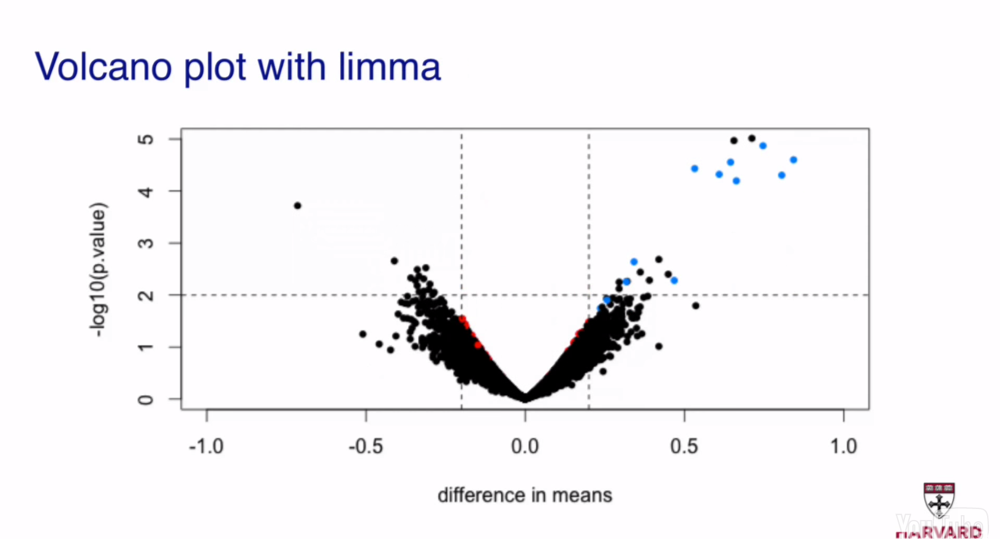

## Modeling

"All models are wrong, but some are useful!" (George E.P. Box)

To say that human height is normally distributed is an example of statistical modeling.

A QQ-plot is useful to check the assumption of a model, e.g., that human height is normally distributed, because it compares the theoretical distribution to the observed distribution.

Other common distributions used for modeling are the binomial, the Poisson, the negative binomial, the gamma, the log-normal, the chi-square, and the exponential distribution.

### Maximum likelihood estimation

All of the aforementioned distributions are parametric, i.e., their shape depends on certain parameters. When modeling, we want to estimate the values of these parameters such that the shape of the distribution/model best fits the observed data. One common approach to doing that is the [Maximum Likelihood Estimation](https://en.wikipedia.org/wiki/Maximum_likelihood) (MLE). In essence, the MLE calculates the probability of the observed data as a function of, for example, lambda if the chosen model is a Poisson distribution, and returns the value of lambda that maximimizes this probability as the estimate of lambda.

## Hierarchical modeling

Hierarchical modeling is also known as [empirical Bayes](https://en.wikipedia.org/wiki/Empirical_Bayes_method).

See also the MLE derived from the observed data vs the shrunken estimate derived from empirical Bayes.

See also the `limma` package approach [PMID:16646809](http://www.ncbi.nlm.nih.gov/pubmed/16646809) of using hierarchical modeling for better estimation/shrinking (posterior) of the stdev of the expression of a specific gene (and thus better estimation of the t-statistic (aka moderated t-statistic) -> p-value of differential expression for that gene) using the average stdev of the expression of all the other genes measured in a transcriptome profiling experiment (prior).

The blue genes are known to be differentially expressed (spike-in experiment), while the red genes, while significant according to the t-tests, are not differentially expressed, i.e., they are false positives.

